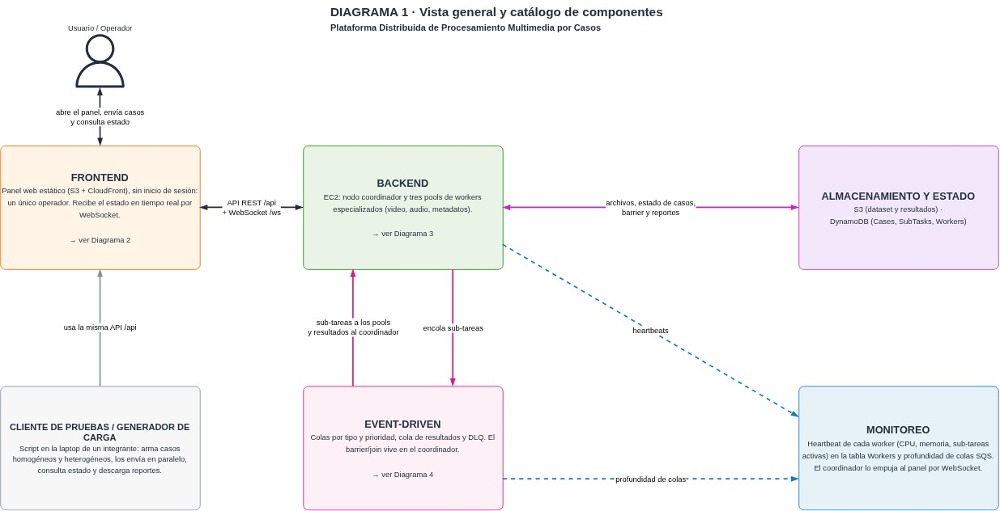

# Plataforma distribuida de procesamiento multimedia por casos

Proyecto I de IC-6600 Principios de Sistemas Operativos (TEC, Campus San Carlos, II Semestre 2026).

El sistema recibe casos de procesamiento, que son grupos de uno o varios archivos de video, audio
o imagen. Cada caso se descompone en sub-tareas según el tipo de cada archivo, las sub-tareas se
ejecutan en paralelo en tres pools de workers y, cuando todas terminan, el caso cierra con un
reporte consolidado.

Este archivo es la documentación técnica. El uso del panel está en el
[manual de usuario](docs/MANUAL_USUARIO.md).

## Arquitectura



Los demás diagramas están en [`docs/diagrams/`](docs/diagrams/).

| Nodo | Rol | Dónde corre |
|---|---|---|
| Coordinador | API, descomposición y routing, barrier, reportes y monitoreo | EC2 t3.small con IP elástica, detrás de CloudFront |
| Worker de video | Conversión de video, extracción de audio y miniaturas de video | EC2 c7i-flex.large |
| Worker de audio | Conversión de audio y miniaturas de imagen | EC2 m7i-flex.large |
| Worker de metadatos | Metadatos, letras y clasificación | EC2 t3.micro |
| Colas | Sub-tareas, resultados y mensajes fallidos | Amazon SQS, 8 colas |
| Estado | Casos, sub-tareas y heartbeats de los workers | Amazon DynamoDB, 3 tablas |
| Archivos | Dataset, resultados, reportes y métricas | Amazon S3, 2 buckets |
| Panel | Observación y envío de casos | S3 y CloudFront |

Cada nodo corre en su propia instancia y ninguno comparte memoria con otro. El coordinador y los
workers nunca se llaman entre sí, se comunican por mensajes en SQS y por el estado en DynamoDB y S3.

### Recorrido de un caso

1. El cliente envía el caso a `POST /api/cases` con la lista de archivos, las operaciones y la
   prioridad.
2. El coordinador ve la extensión de cada archivo y crea una sub-tarea por operación. Un video
   genera conversión, extracción de audio y miniatura. Un audio genera conversión y metadatos. Una
   imagen genera una miniatura.
3. El coordinador guarda el caso y sus sub-tareas en DynamoDB y después publica cada sub-tarea en
   la cola de su pool y prioridad, por ejemplo `video-alta`.
4. Un worker toma la sub-tarea, descarga el archivo de S3, lo procesa, sube la salida y reporta
   cada cambio de estado en la cola de resultados.
5. Por cada sub-tarea terminada, el coordinador resta uno al contador `pending_count` del caso en
   una transacción de DynamoDB. Cuando llega a cero, escribe el reporte en S3 y marca el estado
   final del caso.

### Colas y prioridad

Hay 6 colas de trabajo (`video`, `audio` y `metadatos`, cada una en `alta` y `normal`), una cola de
resultados y una DLQ. Cada worker revisa primero la cola alta de su pool, después la normal y al
final las colas normales de los pools a los que puede ayudar. Ese orden está en
`shared/shared/routing.py` (`POLL_ORDER`).

Un mensaje que un worker no confirma vuelve a la cola al vencer su tiempo de visibilidad (900 s en
video, 300 s en audio y 120 s en metadatos). Después de 3 entregas sin éxito pasa a la DLQ, y el
coordinador marca la sub-tarea como fallida para que el caso no quede abierto.

### Monitoreo

Cada worker escribe cada 5 segundos un heartbeat en la tabla `Workers` con su CPU, su memoria y sus
sub-tareas activas. El coordinador arma una foto del sistema cada 2 segundos, la expone en
`GET /api/state` y la envía por `WS /api/ws`. Un worker que pasa 15 segundos sin reportar aparece
como caído. Hay alerta de saturación cuando una cola alta pasa de 20 mensajes o cuando todos los
workers de un pool pasan de 85% de CPU.

## Estructura del repositorio

```
shared/        Contratos en Pydantic que comparten el coordinador y los workers
               (mensajes, modelos de DynamoDB, estados, routing y API)
coordinator/   API con FastAPI, consumidores de colas, barrier, reportes, monitoreo y pruebas
workers/       Código de los tres pools, operaciones con FFmpeg y API externas, y pruebas
dashboard/     Panel web en React y Vite
infra/         Terraform con los módulos de colas, datos, cómputo y frontend
deploy/        Unidades de systemd y scripts de despliegue
dataset/       Manifiesto de metadatos del dataset y script para subirlo al bucket
docs/          Diagramas, manual de usuario y requisitos de los workers
```

El coordinador, los workers y `shared` forman un workspace de uv. Cada componente tiene su propio
README con el detalle de su diseño.

- [`coordinator/README.md`](coordinator/README.md)
- [`workers/README.md`](workers/README.md)
- [`dashboard/README.md`](dashboard/README.md)
- [`infra/README.md`](infra/README.md)
- [`dataset/README.md`](dataset/README.md)

## Requisitos

Para desplegar hacen falta estas herramientas en la máquina de quien despliega.

- Una cuenta de AWS con permisos sobre EC2, SQS, DynamoDB, S3, CloudFront, IAM y presupuestos, y
  la AWS CLI configurada con esa cuenta
- Git y Terraform 1.9 o superior
- Node.js 18 o superior con npm, para compilar el panel

Para correr el coordinador o los workers fuera de AWS hacen falta Python 3.12,
[uv](https://docs.astral.sh/uv/) y FFmpeg en el PATH.

Las instancias EC2 no necesitan nada instalado a mano. Su script de arranque instala Git, Python
3.12, uv y FFmpeg, y deja la configuración en `/etc/dmp.env`.

## Despliegue

Las instancias no tienen SSH abierto. Se entra con Session Manager, usando los identificadores que
da `terraform output instance_ids`.

```bash
aws ssm start-session --target <instance-id>
```

### 1. Infraestructura

```bash
cd infra
terraform init
terraform apply -var="alert_email=correo@ejemplo.com"
```

`alert_email` es obligatoria y recibe las alertas del presupuesto. Al terminar, `terraform output`
muestra la URL de CloudFront, los identificadores de las instancias, las URL de las colas y los
nombres de las tablas y los buckets. Con `terraform destroy` se borra todo.

Para cambiar el número de workers de un pool sin tocar los demás, se vuelve a aplicar con
`worker_count`.

```bash
terraform apply -var='worker_count={video=3,audio=1,metadatos=1}' -var="alert_email=correo@ejemplo.com"
```

### 2. Coordinador

En la instancia del coordinador, como root.

```bash
curl -fsSL https://raw.githubusercontent.com/FabiSax12/distributed-multimedia-processing/main/deploy/deploy-coordinator.sh | sudo bash
```

El script clona o actualiza el repositorio en `/opt/dmp`, instala las dependencias, registra el
servicio `dmp-coordinator` en systemd y lo reinicia. Para comprobarlo se abre `/api/state` en la
URL de CloudFront.

### 3. Workers

En cada una de las tres instancias worker, como root.

```bash
curl -fsSL https://raw.githubusercontent.com/FabiSax12/distributed-multimedia-processing/main/deploy/deploy-worker.sh | sudo bash
```

El script instala FFmpeg si falta, clona el repositorio, instala las dependencias y arranca el
servicio `dmp-worker`. No hay que indicarle el pool, porque Terraform ya lo dejó en `/etc/dmp.env`
de cada instancia. El mismo comando sirve para actualizar el código. Cada worker debe aparecer en
`GET /api/state` con `alive` en `true`, y sus logs se ven con `journalctl -u dmp-worker -f`.

### 4. Panel

```bash
cd dashboard
npm install
npm run deploy
```

El comando compila el panel, lo sube al bucket del sitio e invalida la caché de CloudFront.

### 5. Dataset

```bash
bash dataset/subir-dataset.sh <carpeta con los 16 archivos base>
```

Sube 30 copias de los archivos base, en las carpetas `lote-01` a `lote-30`, y el `manifest.json`.
El detalle está en [`dataset/README.md`](dataset/README.md).

## Configuración

Terraform escribe estas variables en `/etc/dmp.env` de cada instancia, y el servicio de systemd las
lee de ahí. También genera un `.env.local` en la raíz del repositorio para correr los componentes
desde una laptop contra los recursos reales.

| Variable | Componente | Descripción | Ejemplo |
|---|---|---|---|
| `POOL` | Workers | Pool del worker, define qué colas consume y en qué orden | `metadatos` |
| `WORKER_CONCURRENCY` | Workers | Hilos consumidores por proceso. Opcional, por defecto 2 en video y audio y 4 en metadatos | `4` |
| `QUEUE_URLS` | Ambos | JSON con la URL de cada cola por nombre lógico | `{"video-alta": "https://sqs..."}` |
| `TABLE_CASES` | Ambos | Tabla de casos. Los workers solo la leen para ver si un caso se canceló | `dmp-dev-cases` |
| `TABLE_SUBTASKS` | Coordinador | Tabla de sub-tareas | `dmp-dev-subtasks` |
| `TABLE_WORKERS` | Ambos | Tabla con el heartbeat de cada worker | `dmp-dev-workers` |
| `DATASET_BUCKET` | Ambos | Bucket con los archivos de entrada | `dmp-dev-dataset` |
| `RESULTS_BUCKET` | Ambos | Bucket con las salidas y los reportes | `dmp-dev-results` |
| `AWS_REGION` | Ambos | Región de AWS | `us-east-1` |
| `API_PORT` | Coordinador | Puerto de la API | `8000` |
| `ORIGIN_VERIFY_SECRET` | Coordinador | Secreto del encabezado `X-Origin-Verify` que agrega CloudFront. Vacío desactiva la validación en local | Lo genera Terraform |
| `RESULTS_CONSUMER_THREADS` | Coordinador | Hilos que consumen la cola de resultados | `4` |
| `PRESIGN_EXPIRES_S` | Coordinador | Vigencia de las URL prefirmadas, en segundos | `900` |
| `POOL_SATURATION_QUEUE_THRESHOLD` | Coordinador | Mensajes en una cola alta a partir de los cuales se alerta | `20` |
| `POOL_SATURATION_CPU_PERCENT` | Coordinador | CPU de todos los workers de un pool a partir de la cual se alerta | `85` |

## API

Todas las rutas bajo `/api` se usan a través de CloudFront, que agrega el encabezado
`X-Origin-Verify`. La documentación interactiva está en `/docs` y la especificación OpenAPI en
`/openapi.json`.

| Método | Ruta | Descripción | Respuesta |
|---|---|---|---|
| POST | `/api/cases` | Crear un caso | 201 con `case_id`, `file_count`, `subtask_count` y `prefailed_count` |
| GET | `/api/cases` | Listar los casos recientes, con filtro opcional por estado | Lista de casos |
| GET | `/api/cases/{id}` | Estado del caso y de sus sub-tareas | Caso y lista de sub-tareas |
| DELETE | `/api/cases/{id}` | Pedir la cancelación del caso | Caso actualizado, o 409 si ya terminó |
| GET | `/api/cases/{id}/report` | Reporte consolidado | URL prefirmada, o 409 si el caso no ha terminado |
| GET | `/api/cases/{id}/outputs` | Salidas de cada sub-tarea | Una URL prefirmada por archivo |
| POST | `/api/uploads` | Subir archivos al dataset | `upload_id` y una URL prefirmada de subida por archivo |
| GET | `/api/dataset` | Archivos del dataset con sus metadatos | Lista con ruta, tamaño, tipo y metadatos |
| GET | `/api/state` | Estado del sistema | Casos, workers, colas y alertas, actualizado cada 2 s |
| GET | `/api/metrics` | Muestras de carga de los últimos minutos | Colas y carga por worker, una muestra cada 5 s |
| WS | `/api/ws` | Estado en vivo | El estado cada 2 s y un ping cada 25 s |
| GET | `/healthz` | Salud de los hilos del coordinador | 200 o 503. No pasa por CloudFront |

Un caso se crea con un JSON como este. Si un archivo no trae `operations`, el coordinador usa las
de su tipo.

```json
{
  "label": "Concierto 12-sep",
  "priority": "alta",
  "files": [
    {"input_key": "lote-01/fish.mp4"},
    {"input_key": "lote-01/sunflower.mp3",
     "operations": ["audio_convert", "lyrics"],
     "params": {"target_format": "ogg"}}
  ]
}
```

## Desarrollo y pruebas

```bash
uv sync --all-packages

# Pruebas del coordinador y de los workers, sobre moto (no tocan AWS)
uv run --package coordinator python -m pytest coordinator/tests -v
uv run --package workers python -m pytest workers/tests -v

# Sistema completo en una sola máquina, con el coordinador real y un worker por pool sobre moto
uv run --all-packages python workers/scripts/local_e2e.py
```

Para el panel, `npm run dev` dentro de `dashboard/` lo levanta en el puerto 5173 y reenvía `/api`
al coordinador desplegado.

## Fuera de alcance

- El coordinador es una sola instancia. Si se cae no se pierde el estado, pero no hay réplica.
- El número de workers es fijo durante una ejecución y se cambia a mano con `worker_count`.
- Cancelar un caso descarta las sub-tareas que no han empezado, pero no interrumpe las que ya
  están en ejecución.
- No hay usuarios ni inicio de sesión, y las instancias están en una subred pública con grupos de
  seguridad restrictivos.

## Equipo

- Fabián Ricardo Vargas Araya, coordinador e infraestructura
- David Molina Guerrero, workers y dataset
- Camila Hidalgo Mora, panel
